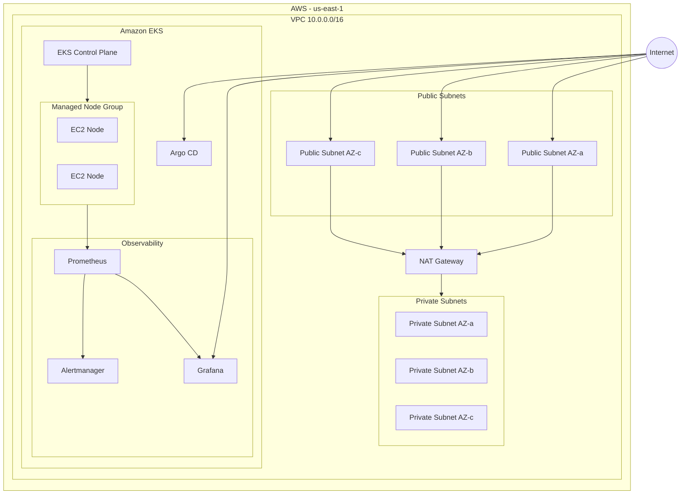

# DESAFIO

Nesta etapa, teremos um desafio técnico com os seguintes objetivos:

* Criar um cluster EKS na AWS utilizando Terraform, com observabilidade configurada via Prometheus e Grafana;
* Disponibilizar a aplicação publicamente;
* Publicar todo o projeto no GitHub;
* Implementar um pipeline de CI/CD;
* Realizar uma simulação de deploy da aplicação durante a apresentação.
* Caso queira implementar funcionalidades adicionais ou melhorias além do escopo solicitado, isso será considerado um diferencial positivo.

---


# AWS EKS + Terraform + Prometheus + Grafana + Argo CD

Infraestrutura como código para provisionamento de um cluster **Amazon EKS** utilizando **Terraform**, com observabilidade baseada em **Prometheus, Grafana e Alertmanager**, além de **Argo CD** para suporte ao modelo GitOps.

O projeto foi desenvolvido como parte de um desafio técnico de infraestrutura/cloud, com foco em demonstrar conhecimentos de:

- AWS
- Amazon EKS
- Kubernetes
- Terraform
- Infrastructure as Code
- Observabilidade
- Prometheus
- Grafana
- Alertmanager
- Argo CD
- Helm
- GitOps
- Automação de infraestrutura
- Segurança e gerenciamento de estado Terraform

---

## 📋 Índice

- [Visão geral](#-visão-geral)
- [Arquitetura](#-arquitetura)
- [Componentes](#-componentes)
- [Estrutura do projeto](#-estrutura-do-projeto)
- [Pré-requisitos](#-pré-requisitos)
- [Configuração AWS](#-configuração-aws)
- [Configuração Terraform](#-configuração-terraform)
- [Provisionamento](#-provisionamento)
- [Acesso ao cluster](#-acesso-ao-cluster)
- [Observabilidade](#-observabilidade)
- [Grafana](#-grafana)
- [Prometheus](#-prometheus)
- [Alertmanager](#-alertmanager)
- [Argo CD](#-argo-cd)
- [Validação da infraestrutura](#-validação-da-infraestrutura)
- [Comandos úteis](#-comandos-úteis)
- [Destroy](#-destruição-da-infraestrutura)
- [Segurança](#-segurança)
- [Backend Terraform](#-backend-terraform)
- [Decisões técnicas](#-decisões-técnicas)
- [Melhorias futuras](#-melhorias-futuras)
- [Troubleshooting](#-troubleshooting)
- [Conclusão](#-conclusão)

---

# 🚀 Visão geral

O objetivo do projeto é provisionar uma infraestrutura Kubernetes completa na AWS utilizando Terraform.

A infraestrutura é composta por:

```text
AWS
│
├── VPC
│   ├── 3 Availability Zones
│   ├── 3 Public Subnets
│   ├── 3 Private Subnets
│   └── NAT Gateway
│
└── Amazon EKS
    │
    ├── Control Plane
    │
    ├── Managed Node Group
    │   └── EC2 t3.medium
    │
    ├── Kubernetes Add-ons
    │   ├── VPC CNI
    │   ├── CoreDNS
    │   ├── kube-proxy
    │   └── EKS Pod Identity Agent
    │
    └── Kubernetes Applications
        ├── Prometheus
        ├── Grafana
        ├── Alertmanager
        └── Argo CD
```

Toda a infraestrutura é criada de forma declarativa através do Terraform.

---

# 🏗 Arquitetura

## Visão arquitetural



---

# ☁️ Componentes

| Componente | Tecnologia | Objetivo |
|---|---|---|
| Cloud | AWS | Provedor de infraestrutura |
| IaC | Terraform | Provisionamento automatizado |
| Kubernetes | Amazon EKS | Orquestração de containers |
| Networking | VPC | Isolamento e conectividade |
| Compute | EC2 | Nodes do cluster |
| Observabilidade | Prometheus | Coleta de métricas |
| Dashboards | Grafana | Visualização das métricas |
| Alertas | Alertmanager | Gerenciamento de alertas |
| GitOps | Argo CD | Entrega contínua baseada em Git |
| Package Manager | Helm | Instalação dos componentes Kubernetes |
| State | Amazon S3 | Armazenamento remoto do Terraform State |

---

# 📁 Estrutura do projeto

```text
desafio-ppay-iac/
│
├── README.md
├── .gitignore
│
├── workflows/
│
└── eks-teste/
    │
    ├── main.tf
    ├── providers.tf
    ├── variables.tf
    ├── outputs.tf
    ├── terraform.tfvars
    │
    ├── network/
    │   ├── vpc.tf
    │   ├── variables.tf
    │   └── outputs.tf
    │
    ├── eks/
    │   ├── eks.tf
    │   ├── variables.tf
    │   └── outputs.tf
    │
    └── pods/
        ├── monitoring.tf
        ├── argoscd.tf
        ├── variables.tf
        └── output.tf
```

---

# 🔧 Pré-requisitos

Antes de executar o projeto, é necessário instalar:

- AWS CLI
- Terraform
- kubectl
- Helm
- Git

Versões recomendadas:

```text
Terraform >= 1.14
AWS Provider >= 5.99.1
Terraform AWS VPC Module ~> 6.0
Terraform AWS EKS Module ~> 21.0
```

Verifique as instalações:

```bash
terraform version
aws --version
kubectl version --client
helm version
git --version
```

---

# 🔐 Configuração AWS

O Terraform utiliza o provider da AWS.

Configure suas credenciais através da AWS CLI:

```bash
aws configure
```

Informe:

```text
AWS Access Key ID
AWS Secret Access Key
Default region name
Default output format
```

A região utilizada pelo projeto é:

```text
us-east-1
```

Valide o acesso:

```bash
aws sts get-caller-identity
```

O comando deve retornar a identidade AWS utilizada pelo Terraform.

---

# 🌐 Networking

A infraestrutura utiliza uma VPC com CIDR:

```text
10.0.0.0/16
```

São utilizadas três Availability Zones:

```text
us-east-1a
us-east-1b
us-east-1c
```

## Public Subnets

```text
10.0.101.0/24
10.0.102.0/24
10.0.103.0/24
```

As subnets públicas recebem a tag:

```text
kubernetes.io/role/elb = 1
```

Essa configuração permite que recursos Kubernetes que utilizem LoadBalancer possam utilizar subnets públicas.

## Private Subnets

```text
10.0.1.0/24
10.0.2.0/24
10.0.3.0/24
```

As subnets privadas recebem:

```text
kubernetes.io/role/internal-elb = 1
```

Os nodes do EKS são executados nas subnets privadas.

---

# 🌎 NAT Gateway

A VPC utiliza:

```hcl
enable_nat_gateway = true
single_nat_gateway = true
```

Foi utilizada uma estratégia de **NAT Gateway único**, reduzindo o custo da infraestrutura para o ambiente do desafio.

Em um ambiente produtivo com requisitos maiores de disponibilidade, pode ser considerada a utilização de NAT Gateway por Availability Zone.

---

# ☸️ Amazon EKS

O cluster é criado utilizando o módulo oficial:

```text
terraform-aws-modules/eks/aws
```

Versão utilizada:

```text
~> 21.0
```

O cluster utiliza:

```text
endpoint_public_access  = true
endpoint_private_access = true
```

Ou seja, o endpoint do Kubernetes possui acesso público e privado.

---

# 🖥 Managed Node Group

O cluster possui um Managed Node Group:

```text
default
```

Configurado com:

```text
Instance Type: t3.medium
```

Auto Scaling:

```text
Minimum: 2
Desired: 2
Maximum: 4
```

Os nodes são provisionados nas subnets privadas.

Isso permite que as workloads Kubernetes não sejam diretamente expostas à Internet.

---

# 🧩 EKS Add-ons

O cluster habilita os seguintes add-ons:

### VPC CNI

Responsável pela integração de networking entre Kubernetes e AWS VPC.

```text
vpc-cni
```

### CoreDNS

Responsável pela resolução DNS dentro do cluster.

```text
coredns
```

### kube-proxy

Responsável pelas regras de rede necessárias para comunicação dos Services.

```text
kube-proxy
```

### EKS Pod Identity Agent

Permite integração de workloads Kubernetes com permissões AWS utilizando Pod Identity.

```text
eks-pod-identity-agent
```

---

# 📊 Observabilidade

A observabilidade é implementada utilizando o chart:

```text
kube-prometheus-stack
```

Esse stack integra:

- Prometheus
- Grafana
- Alertmanager
- Kubernetes exporters
- ServiceMonitors
- PodMonitors
- regras de alertas

O chart é instalado via Helm através do Terraform.

---

# 🔵 Prometheus

O Prometheus é configurado através do:

```text
kube-prometheus-stack
```

A retenção configurada atualmente é:

```text
7 dias
```

Configuração:

```yaml
prometheus:
  prometheusSpec:
    retention: 7d
```

O Prometheus coleta métricas relacionadas à infraestrutura Kubernetes e seus componentes monitorados.

Exemplos de métricas que podem ser utilizadas:

```text
CPU
Memory
Pod status
Node status
Container restarts
Network
Kubernetes API
Workload availability
```

---

# 📈 Grafana

O Grafana é habilitado através do `kube-prometheus-stack`.

O serviço é configurado como:

```text
LoadBalancer
```

Isso permite acesso externo ao Grafana através de um endereço fornecido pela AWS.

A senha administrativa é gerada automaticamente pelo Terraform através do recurso:

```text
random_password
```

São utilizados:

```text
Length: 24 characters
```

A senha é marcada como:

```text
sensitive = true
```

---

# 🔑 Recuperando a senha do Grafana

Depois do `terraform apply`, a senha pode ser recuperada através do output:

```bash
terraform output -raw grafana_admin_password
```

Como o output é sensível, ele não é exibido diretamente em algumas situações.

---

# 🚨 Alertmanager

O Alertmanager também é habilitado:

```yaml
alertmanager:
  enabled: true
```

Ele é responsável pelo gerenciamento dos alertas gerados pelo Prometheus.

Entre suas funções estão:

- agrupamento de alertas;
- deduplicação;
- roteamento;
- silenciamento;
- integração com canais de notificação.

---

# 🔄 Argo CD

O Argo CD é instalado utilizando Helm:

```text
argo-cd
```

Repository:

```text
https://argoproj.github.io/argo-helm
```

Namespace:

```text
argocd
```

O serviço do Argo CD é configurado como:

```text
LoadBalancer
```

Isso permite acesso externo à interface.

---

# 🔐 Argo CD Insecure

Para simplificar o ambiente do desafio, o Argo CD está configurado com:

```text
--insecure
```

e:

```yaml
server.insecure: true
```

Isso significa que o acesso HTTPS nativo do Argo CD não está sendo utilizado nessa configuração.

Em ambiente produtivo, recomenda-se utilizar:

- TLS;
- certificado válido;
- AWS Load Balancer;
- Ingress;
- ACM;
- autenticação adequada;
- restrição de acesso.

---

# 🧱 Terraform Modules

O projeto foi dividido em módulos para separar responsabilidades.

## Network

Responsável pela criação da VPC:

```text
network/
```

Principais recursos:

- VPC
- Public Subnets
- Private Subnets
- NAT Gateway
- DNS support
- DNS hostnames
- Kubernetes subnet tags

---

## EKS

Responsável pelo cluster Kubernetes:

```text
eks/
```

Principais recursos:

- EKS Control Plane
- Managed Node Group
- EKS Add-ons
- IAM/IRSA
- Cluster networking

---

## Pods / Kubernetes Services

Responsável pelos componentes instalados dentro do cluster:

```text
pods/
```

Atualmente:

```text
Prometheus
Grafana
Alertmanager
Argo CD
```

---

# 🗃 Terraform State

O projeto utiliza backend remoto S3.

Configuração:

```hcl
backend "s3" {
  bucket  = "tf-000dff5b362a"
  key     = "picpay/proj-eks/terraform.tfstate"
  region  = "us-east-1"
  encrypt = true
}
```

O Terraform State é armazenado remotamente no S3.

Isso evita manter o estado apenas localmente e facilita a utilização do Terraform em ambientes compartilhados.

---

# ⚠️ Importante sobre o Backend

Antes de executar o projeto em outra conta AWS, altere o bucket configurado no backend:

```hcl
bucket = "SEU-BUCKET"
```

O bucket precisa existir previamente.

Exemplo:

```bash
aws s3 mb s3://meu-terraform-state --region us-east-1
```

Depois configure o backend conforme o ambiente.

---

# ⚙️ Configuração Terraform

O arquivo de variáveis utilizado no ambiente contém:

```hcl
aws_region = "us-east-1"

project_name = "eks-01teste"

environment = "dev"

vpc_cidr = "10.0.0.0/16"

cluster_version = "1.36"

node_instance_types = [
  "t3.medium"
]

node_min_size     = 2
node_max_size     = 4
node_desired_size = 2
```

---

# 🚀 Provisionamento

Entre no diretório Terraform:

```bash
cd eks-teste
```

Inicialize o Terraform:

```bash
terraform init
```

Valide a configuração:

```bash
terraform validate
```

Formate os arquivos:

```bash
terraform fmt -recursive
```

Visualize o plano:

```bash
terraform plan
```

Aplique a infraestrutura:

```bash
terraform apply
```

Confirme:

```text
yes
```

O Terraform irá criar os recursos necessários na AWS.

---

# 🔍 Verificando o Terraform

Após o provisionamento:

```bash
terraform output
```

Para consultar especificamente o cluster:

```bash
terraform output -module=eks
```

Os outputs principais incluem:

```text
cluster_endpoint
cluster_name
cluster_certificate_authority_data
grafana_admin_password
```

---

# ☸️ Acessando o EKS

Configure o `kubectl`:

```bash
aws eks update-kubeconfig \
  --region us-east-1 \
  --name eks-01teste
```

Valide:

```bash
kubectl get nodes
```

Exemplo:

```text
NAME                                      STATUS   ROLES    AGE
ip-10-0-x-x.ec2.internal                  Ready    <none>   ...
ip-10-0-x-x.ec2.internal                  Ready    <none>   ...
```

---

# 📦 Verificando os namespaces

```bash
kubectl get namespaces
```

Os principais namespaces esperados são:

```text
argocd
monitoring
kube-system
```

---

# 🔎 Verificando workloads

```bash
kubectl get pods -A
```

Para observar somente monitoramento:

```bash
kubectl get pods -n monitoring
```

Para Argo CD:

```bash
kubectl get pods -n argocd
```

---

# 🌐 Verificando os LoadBalancers

Grafana:

```bash
kubectl get svc -n monitoring
```

Argo CD:

```bash
kubectl get svc -n argocd
```

Os serviços configurados como `LoadBalancer` deverão receber um endereço externo da AWS.

---

# 📊 Acessando o Grafana

Obtenha o endereço:

```bash
kubectl get svc -n monitoring
```

Procure pelo serviço do Grafana.

Também pode ser utilizado:

```bash
kubectl get svc -n monitoring | grep grafana
```

Acesse o endereço retornado pelo LoadBalancer.

Usuário padrão:

```text
admin
```

Senha:

```bash
terraform output -raw grafana_admin_password
```

---

# 🔵 Acessando o Prometheus

Liste os serviços:

```bash
kubectl get svc -n monitoring
```

O Prometheus é executado dentro do namespace:

```text
monitoring
```

Para acesso local temporário:

```bash
kubectl port-forward \
  -n monitoring \
  svc/kube-prometheus-stack-prometheus \
  9090:9090
```

Depois acesse:

```text
http://localhost:9090
```

---

# 🚨 Verificando Alertmanager

Liste os serviços:

```bash
kubectl get svc -n monitoring
```

Para acesso local:

```bash
kubectl port-forward \
  -n monitoring \
  svc/kube-prometheus-stack-alertmanager \
  9093:9093
```

Acesse:

```text
http://localhost:9093
```

---

# 🔄 Acessando o Argo CD

Obtenha o LoadBalancer:

```bash
kubectl get svc -n argocd
```

Procure:

```text
argocd-server
```

Como o servidor foi configurado com:

```text
--insecure
```

o acesso pode ser realizado através do endpoint HTTP disponibilizado pelo LoadBalancer.

---

# 🧪 Validação da infraestrutura

Depois do deploy, recomenda-se executar:

## Nodes

```bash
kubectl get nodes -o wide
```

## Pods

```bash
kubectl get pods -A
```

## Services

```bash
kubectl get svc -A
```

## Deployments

```bash
kubectl get deployments -A
```

## Helm releases

```bash
helm list -A
```

---

# 📈 Validação da observabilidade

No Grafana, validar:

### Cluster

- CPU dos nodes
- Memória dos nodes
- Número de pods
- Status dos nodes

### Kubernetes

- Pod restarts
- CPU por namespace
- Memory por namespace
- Workload status
- Container resources

### Prometheus

Validar consultas como:

```promql
up
```

e:

```promql
sum(rate(container_cpu_usage_seconds_total[5m]))
```

Também podem ser utilizadas métricas específicas do Kubernetes disponibilizadas pelo stack.

---

# 🛠 Comandos úteis

## Terraform

```bash
terraform init
```

```bash
terraform fmt -recursive
```

```bash
terraform validate
```

```bash
terraform plan
```

```bash
terraform apply
```

```bash
terraform output
```

```bash
terraform show
```

---

## Kubernetes

```bash
kubectl get nodes
```

```bash
kubectl get pods -A
```

```bash
kubectl get svc -A
```

```bash
kubectl get deployments -A
```

```bash
kubectl describe pod <pod> -n <namespace>
```

```bash
kubectl logs <pod> -n <namespace>
```

---

## Helm

```bash
helm list -A
```

```bash
helm status kube-prometheus-stack -n monitoring
```

```bash
helm status argocd -n argocd
```

---

# 💥 Destruição da infraestrutura

Para remover toda a infraestrutura criada pelo Terraform:

```bash
terraform destroy
```

Confirme:

```text
yes
```

⚠️ **Atenção:** esse comando remove os recursos gerenciados pelo Terraform e pode gerar custos caso alguns recursos permaneçam fora do gerenciamento ou existam dependências externas.

---

# 🔐 Segurança

Algumas práticas de segurança foram consideradas no projeto:

### Nodes em subnets privadas

Os Managed Nodes do EKS são executados nas subnets privadas.

### Terraform State remoto

O estado é armazenado no S3.

### State encryption

O backend utiliza:

```hcl
encrypt = true
```

### Senha do Grafana

A senha é:

- gerada automaticamente;
- armazenada como sensitive output;
- não deve ser versionada no Git.

### `.tfvars`

Arquivos `.tfvars` estão adicionados ao `.gitignore` para evitar publicação acidental de informações sensíveis.

---

# ⚠️ Considerações para produção

O projeto foi desenhado para um ambiente de desafio técnico e demonstração.

Para produção, algumas melhorias seriam recomendadas.

## NAT Gateway

Atualmente:

```text
single_nat_gateway = true
```

Uma arquitetura de produção poderia utilizar NAT Gateway por Availability Zone.

---

## Grafana

Atualmente o Grafana utiliza:

```text
LoadBalancer
```

Para produção poderia ser utilizado:

```text
AWS Load Balancer
        ↓
Ingress
        ↓
Grafana
```

com:

- TLS;
- ACM;
- DNS;
- autenticação;
- restrição de acesso.

---

## Argo CD

O projeto utiliza:

```text
server.insecure = true
```

Para produção, recomenda-se:

```text
HTTPS
TLS
ACM
Ingress
Authentication
Network restrictions
```

---

## Secrets

Em produção, senhas e secrets poderiam ser gerenciados através de:

- AWS Secrets Manager;
- AWS Systems Manager Parameter Store;
- External Secrets Operator;
- Kubernetes Secrets integrado a um mecanismo seguro de gerenciamento.

---

# 🧠 Decisões técnicas

## Por que Terraform?

Terraform permite representar a infraestrutura como código e oferece:

- versionamento;
- reprodutibilidade;
- revisão através de Git;
- automação;
- planejamento de mudanças;
- padronização;
- integração com CI/CD.

---

## Por que EKS?

O Amazon EKS reduz a necessidade de gerenciamento direto do control plane Kubernetes.

A AWS fica responsável pela infraestrutura do control plane, enquanto o projeto controla principalmente:

```text
Nodes
Networking
Workloads
Add-ons
Observability
Deployments
```

---

## Por que Managed Node Groups?

O Managed Node Group simplifica:

- provisionamento dos nodes;
- integração com EKS;
- ciclo de vida;
- atualização dos nodes;
- escalabilidade.

---

## Por que Prometheus?

Prometheus é uma solução amplamente utilizada para monitoramento de ambientes Kubernetes e fornece:

- modelo de métricas;
- PromQL;
- ServiceMonitor;
- integração com Kubernetes;
- integração com Grafana.

---

## Por que Grafana?

O Grafana permite transformar métricas coletadas pelo Prometheus em dashboards operacionais.

Isso facilita a visualização de:

```text
CPU
Memory
Pods
Nodes
Containers
Namespaces
Applications
```

---

## Por que Argo CD?

O Argo CD permite implementar uma abordagem GitOps, onde o Git se torna a fonte de verdade para os manifests e configurações de aplicações Kubernetes.

O fluxo esperado é:

```text
Developer
    │
    ▼
Git Repository
    │
    ▼
Argo CD
    │
    ▼
Kubernetes / EKS
```

---

# 🔄 Fluxo de infraestrutura

O fluxo de criação é:

```text
terraform init
       │
       ▼
terraform plan
       │
       ▼
terraform apply
       │
       ▼
VPC
       │
       ▼
EKS
       │
       ▼
Managed Nodes
       │
       ▼
Helm
       │
       ├── Prometheus
       ├── Grafana
       ├── Alertmanager
       └── Argo CD
```

---

# 🧪 Troubleshooting

## Terraform pede a senha do Grafana

Isso ocorre porque a senha é gerenciada pelo recurso:

```text
random_password.grafana_admin
```

Execute:

```bash
terraform output -raw grafana_admin_password
```

---

## Nodes não ficam Ready

Verifique:

```bash
kubectl get nodes
```

Depois:

```bash
kubectl describe node <node>
```

Também valide:

```bash
kubectl get pods -n kube-system
```

---

## Grafana não recebe endereço externo

Verifique:

```bash
kubectl get svc -n monitoring
```

Depois:

```bash
kubectl describe svc <grafana-service> -n monitoring
```

Também valide as subnets públicas e as tags:

```text
kubernetes.io/role/elb
```

---

## Argo CD não recebe LoadBalancer

Execute:

```bash
kubectl get svc -n argocd
```

Depois:

```bash
kubectl describe svc argocd-server -n argocd
```

---

## Prometheus não está coletando métricas

Verifique:

```bash
kubectl get pods -n monitoring
```

E:

```bash
kubectl get servicemonitors -A
```

Também é possível consultar os targets diretamente pela interface do Prometheus.

---

# 📌 Estado atual do desafio

A infraestrutura IaC atualmente contempla:

| Requisito | Implementação |
|---|---|
| AWS | ✅ |
| Terraform | ✅ |
| VPC | ✅ |
| Subnets públicas | ✅ |
| Subnets privadas | ✅ |
| NAT Gateway | ✅ |
| EKS | ✅ |
| Managed Node Group | ✅ |
| Kubernetes Add-ons | ✅ |
| Prometheus | ✅ |
| Grafana | ✅ |
| Alertmanager | ✅ |
| Argo CD | ✅ |
| LoadBalancer | ✅ |
| Terraform State remoto | ✅ |
| Aplicação Hello World | 🔲 |
| Deploy da aplicação | 🔲 |
| Pipeline CI/CD | 🔲 |
| GitOps completo | 🔲 |

> Os itens marcados como 🔲 representam componentes que não estão presentes na versão atual deste repositório.

---

# 🚧 Próximas melhorias

Para completar o desafio técnico de ponta a ponta, a próxima etapa recomendada é adicionar uma aplicação simples e seu processo de entrega.

Arquitetura esperada:

```text
Developer
    │
    ▼
GitHub
    │
    ├── Application Code
    │
    └── Infrastructure Code
          │
          ▼
      GitHub Actions
          │
          ├── Tests
          ├── Build
          ├── Docker Image
          └── Push Registry
                    │
                    ▼
                  ECR
                    │
                    ▼
                 Argo CD
                    │
                    ▼
                  EKS
                    │
                    ▼
               Application
                    │
                    ▼
             Prometheus
                    │
                    ▼
                 Grafana
```

---

# 🎯 Objetivo final

A arquitetura completa deverá demonstrar o ciclo:

```text
Código
  ↓
Git
  ↓
CI
  ↓
Docker
  ↓
Container Registry
  ↓
CD / GitOps
  ↓
EKS
  ↓
Application
  ↓
Metrics
  ↓
Prometheus
  ↓
Grafana
  ↓
Observability
```

Esse fluxo permite demonstrar não apenas a criação do cluster, mas também o ciclo completo de **Infrastructure as Code + CI/CD + Kubernetes + Observabilidade + GitOps**.

---
